# Execution Analysis Round 2

- During the test execution it was seen several error 500, server side errors
- The error rate was below 0.5 %
- The average response time seems affected which is above the *1000 ms threshold* set for the customer
- it is recommended to investigate the application logs to understand what error was being reported in application side when the http 500 status codes were happening
- The *Page Load* transaction was around 15 seconds in 90th pct
- The *Create Ticket* transaction was around 16 seconds in 90th pct
- In the minute 19 of the test execution it was seen a significant increase in the average response times of all the transactions the increase didn't recover and kept in the same way until the end of the test.
- It is recommended to do cross validation on KPI on server side on the minute 19 of the test execution
- Number of threads were steady, so there are no reason to suspect a connection issue or test side issue
- There is a correlation between the increase of the response times in minute 19 fo the execution with the drop of the number of transactions per second, we were getting ~1 TPS and it suddenly dropped below 50% (~0.5 TPS) after minute 19 of test execution
- It was seen a spike in the disk read in minute 14 of test execution in the nmon data server side in the SDA disk of the server which is the main disk of the VM that host the application
- When looking into the partitions that the server is using, it was found the sda3 is the main partition
- Correlating the disk read KPI with the the main partition it was noticed this partition was the one reporting the peak from the virtual disk of the VM
- This lead to suspect the high disk utilization on reading could affect the performance of the application
- In terms of IO Disk operations it was noticed during the previous minutes of the same period of time (14 minute) there was a decrease on the IO disk operations and then after 4 minutes an spike in the IO again in the same 14 minute
- The above lead us to think the IO disk operations were stuck in some percentage not being able to be processed for a period of 4 minutes and then the resources were released again and used and it was where the spike happened
- The pattern of the IO disk dropping is repeated some times during the test
- The RAM memory again was high utilized, which can be a concern later on
- There are small spikes in the Networking packages reads but it is not enough to suspect a networking problem
- There was a spike in the pswitch performance counter in minute 14 of the execution which can be correlated to the high CPU utilization, pointing problems of processing
- It is important to say that when correlating Top process consuming CPU, it was seen that Apache (web server) had an impact in **Wait time** performance counter which correlates to some of the performance issues of the application in minute 19
- It also was seen multiple times in the same point of concerns in the test (minute 14 and 19) that there was **minor faults** (memory pages) which can be correlated to memory swapping due to a high memory utilization. This confirms a possible issue on a previous point where memory utilization was a possible concern. 

### Execution evidence

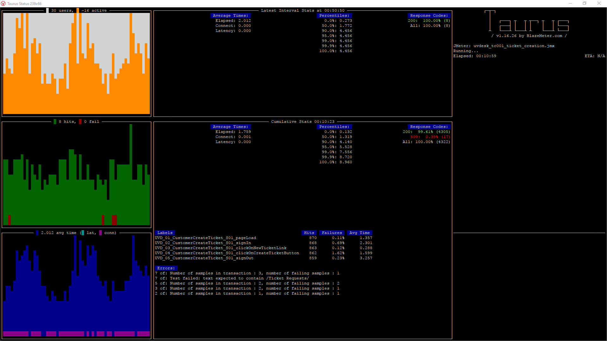

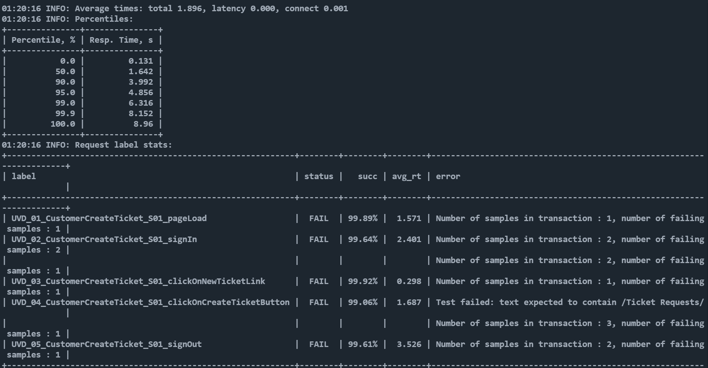

### Supporting images from issues seen

Average Response Time Increase
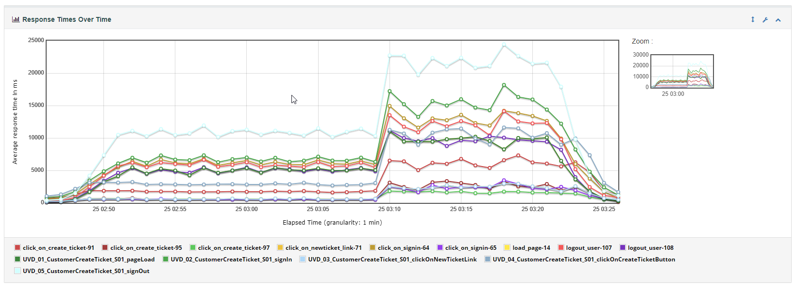

Transactions Per Second Drop
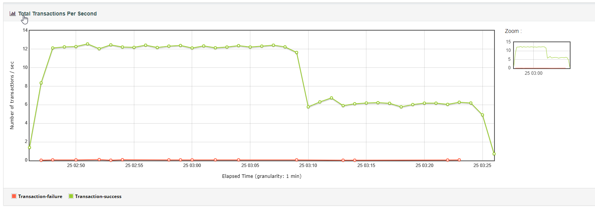

Disk Reading Spike in SDA/SDA3
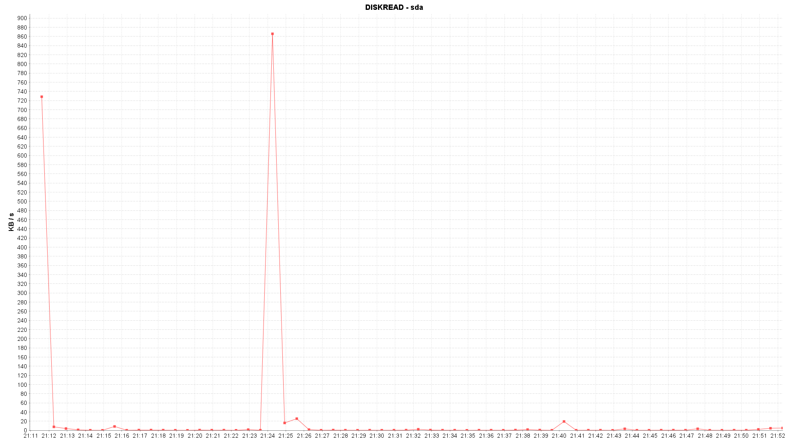
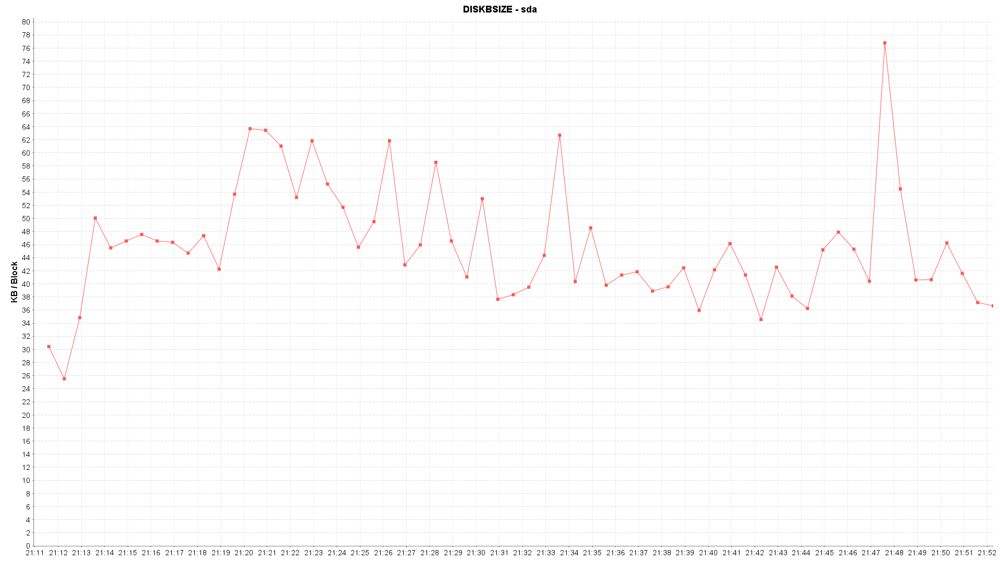

IO Disk Utilization Spike
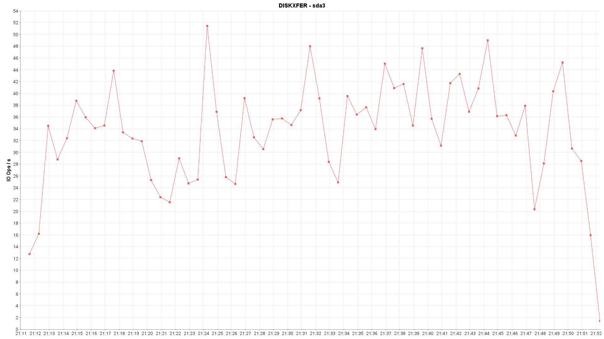

Memory Free/Utilization
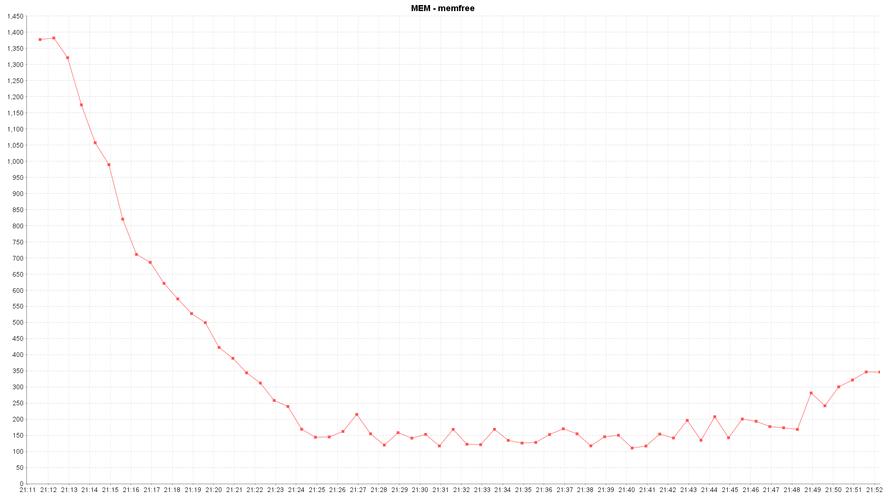

Pswitching Spikes
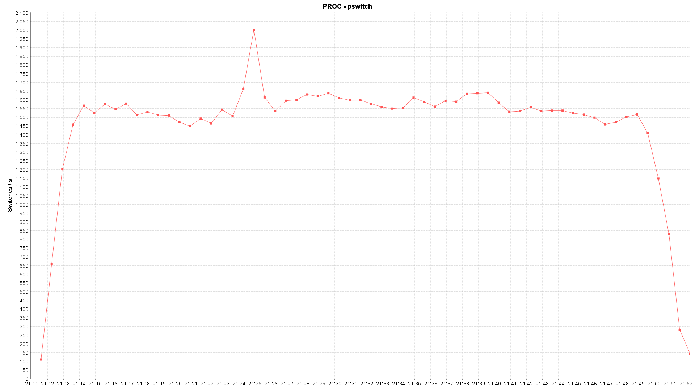

Wait time and Minor Page Faults
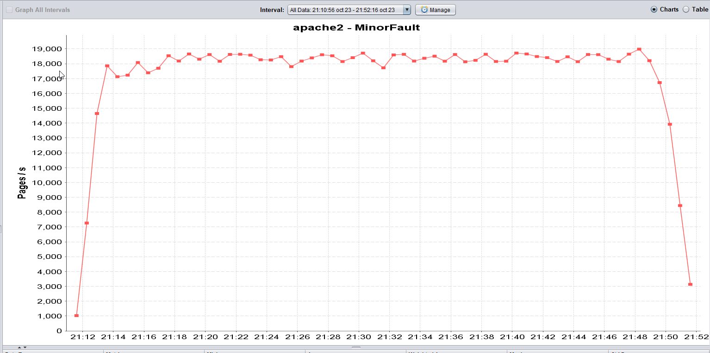

Process on wait status

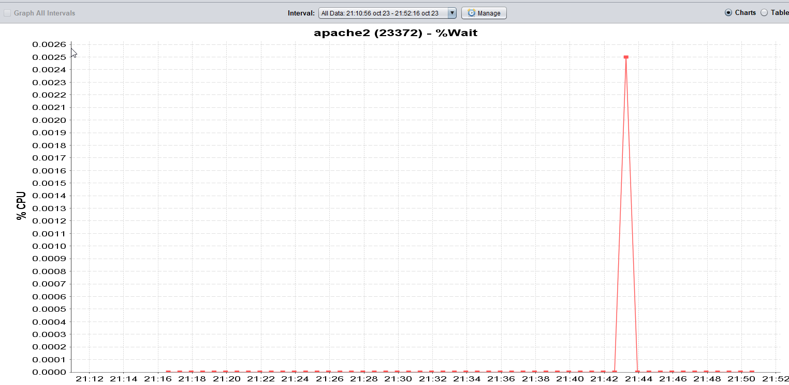

Memory page issues (Virtual Memory)
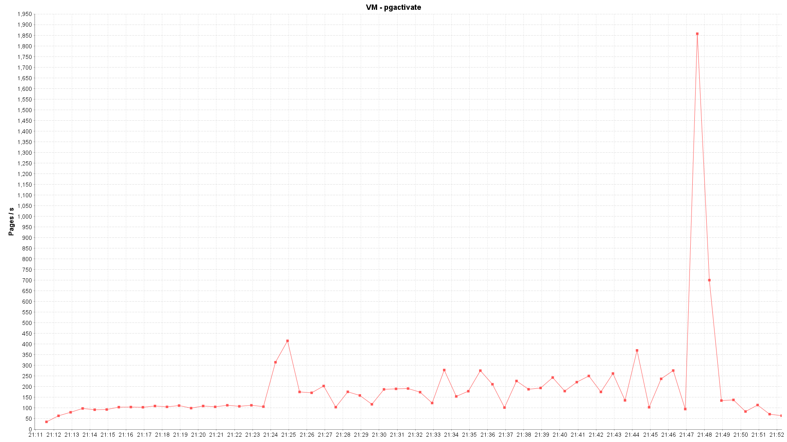

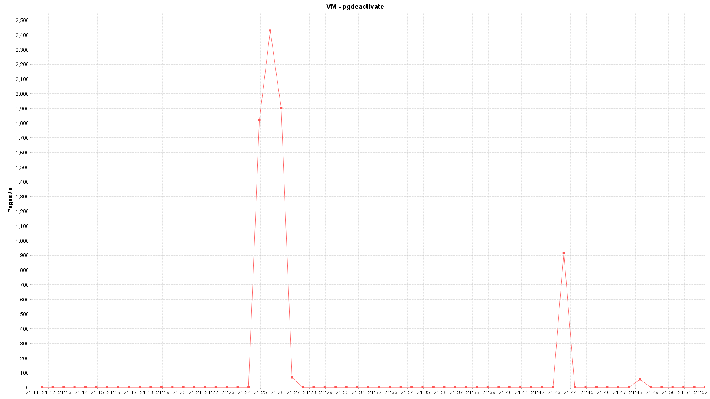

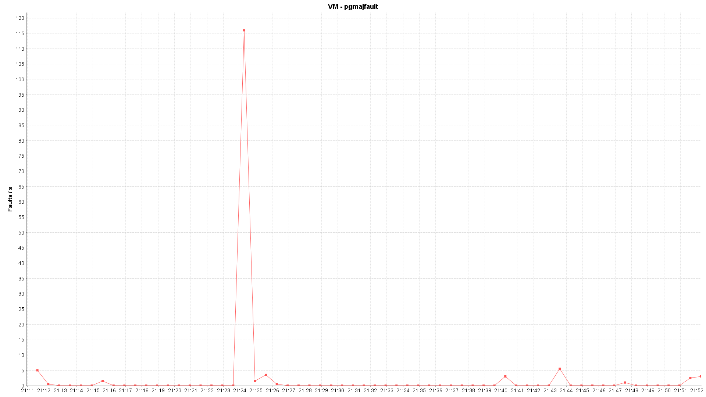