# Execution Log Iteration 3

- It was noticed the test started very good after the adjustments on hardware
- After more than 15 threads where introduced and load went beyond the planned 3 TPS there was a point where the response time moved up from ~ 1 second per transaction to ~ 4 seconds per transaction
- Average TPS are ~ 7 TPS so, this is provoking the high RTs due to we are over stressing the application.
- As how the test is configured today it is a 2X test (200%) of load
- The pacing time needs to be adjusted to the double to attempt to emulate the production load correctly to target 3 TPS
- Before the adjustment on pacing for trying to reach the planned load. It needs to be explored the recommendations.
- In spite the overload, this time errors terms of transactions fails and error rate was not that bad as first tests. 
- Also it seems Memory counters looks better, we need to wait until review the server side KPI with *nmon*
- There is a worry when watching the Memory utilization in real time, the memory seems not to be released correctly and in spite the steady state was reached more than 10 minutes ago the memory keep being exhausted, keep used and doesn't release.
- Also the hard disk is being full it started in 60% now it went until 95%

### Supporting Images

**JMeter Execution**
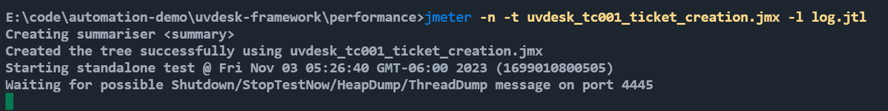

**Test Side KPI with Grafana**
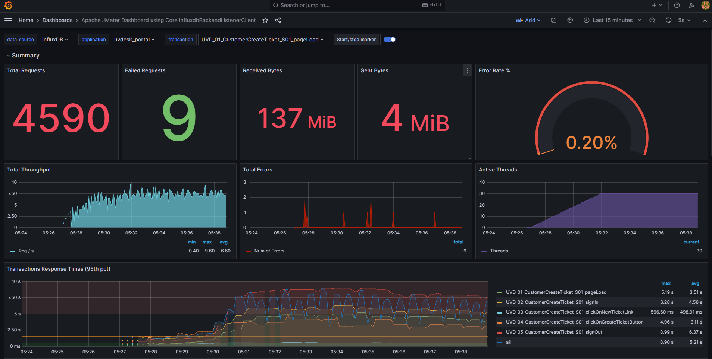

**Response Over Time**
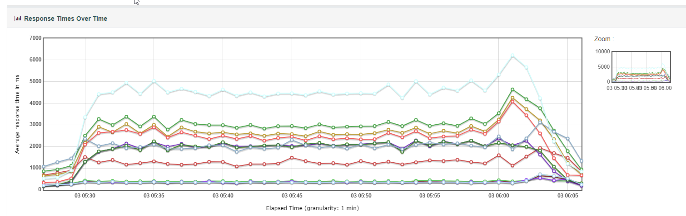

**Transactions per Second**
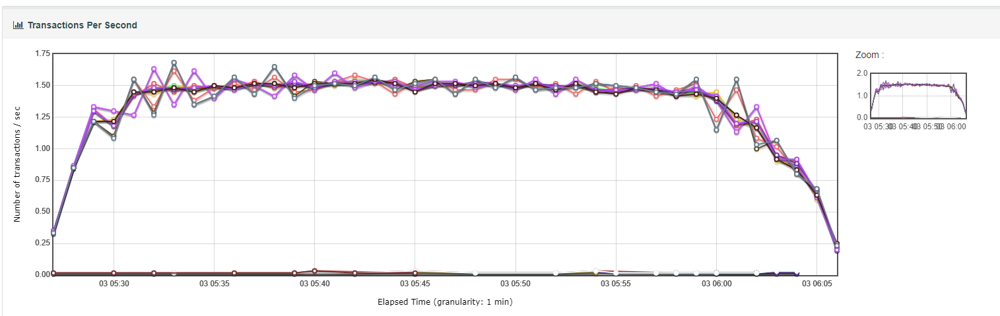

**CPU Utilization**
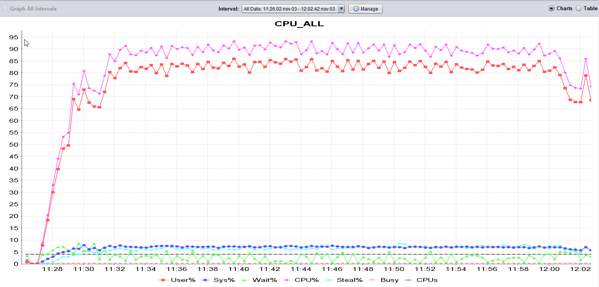

**Disk Busy**
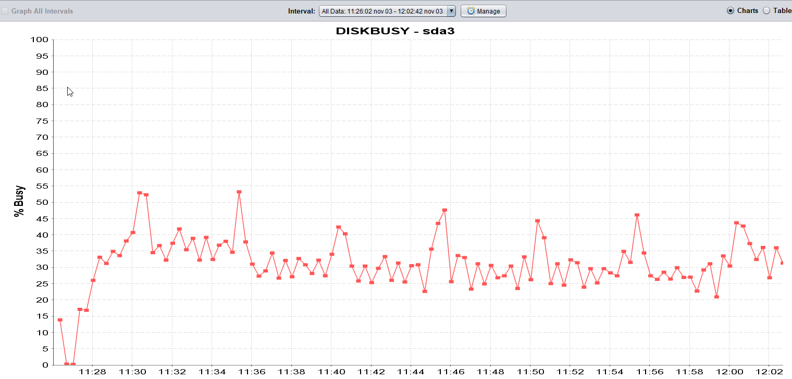

**Memory Free and Memory Cached**
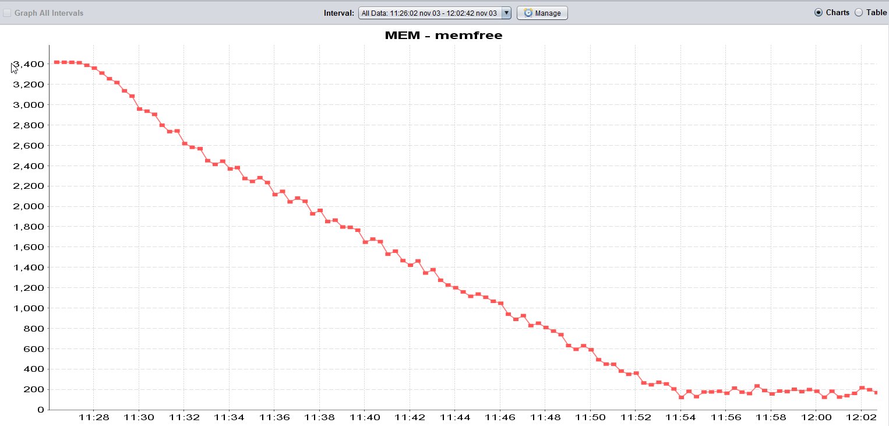

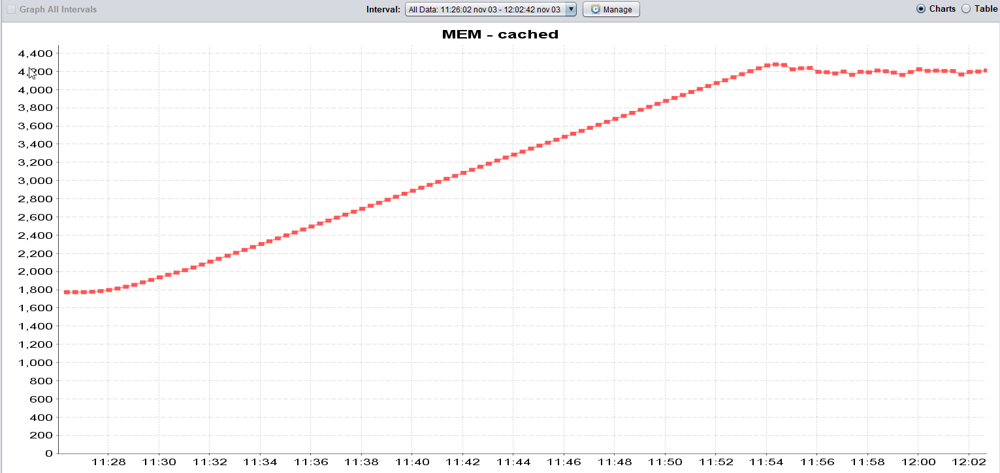

**Apache (web server) CPU Waits **

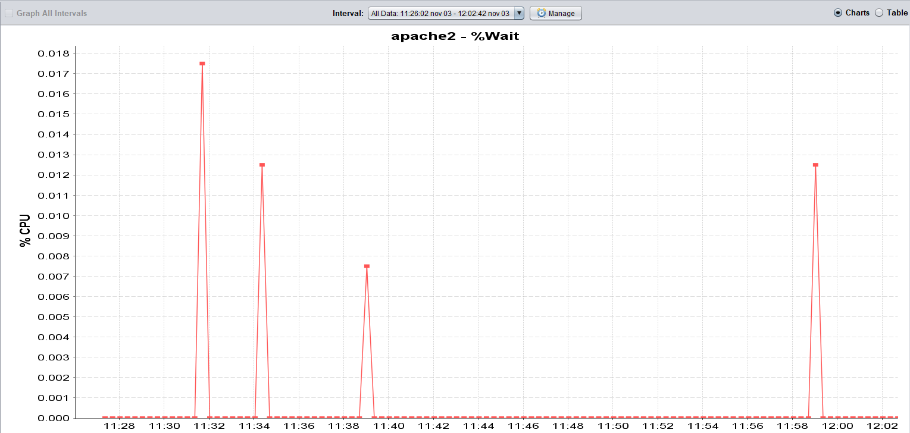

### Memory and disk space issue

**Disk Space issue noticed**

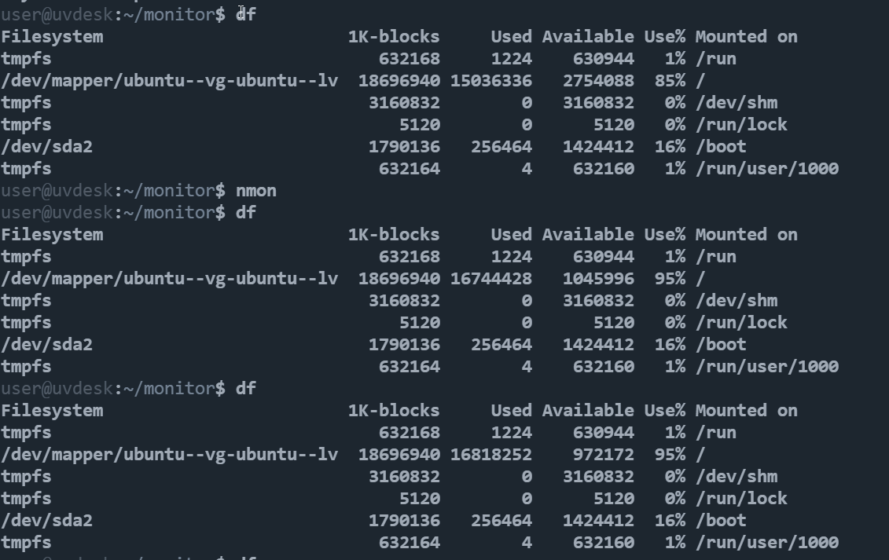

**Memory not released issue**

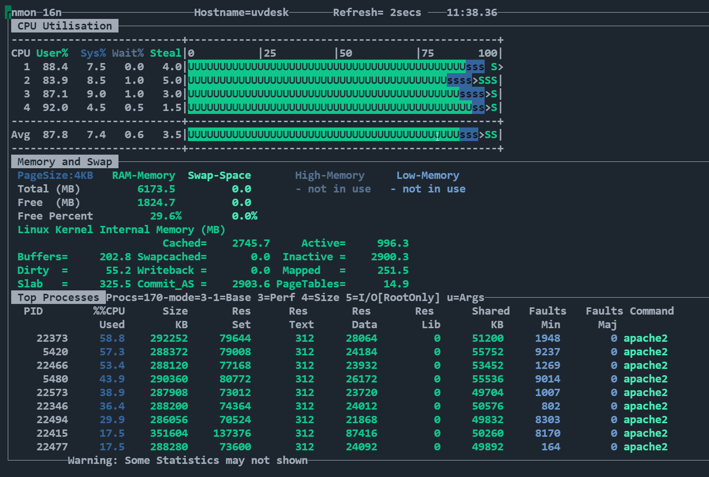

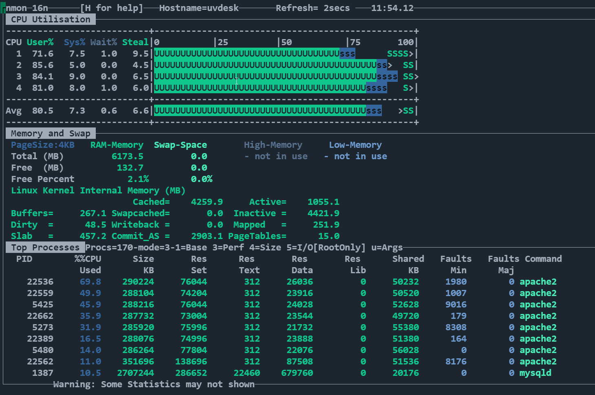

