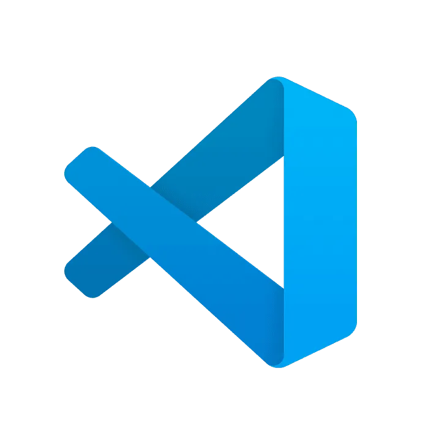

# Selected IDE

For the automation effort Visual Studio Code has been selected, the decision was based because it is free and easy to use, lightweight and very extensible to work under different programming languages and technologies.

Also it has a strong community that creates good documentation and plugins that extend the functionality to make it work as an IDE if required but much faster. 

### [Official page](https://code.visualstudio.com/)

