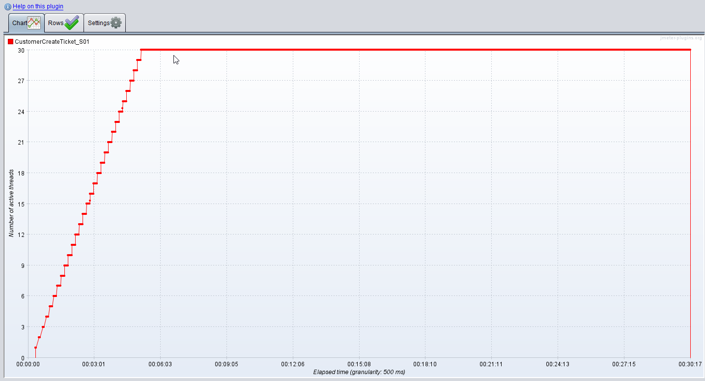
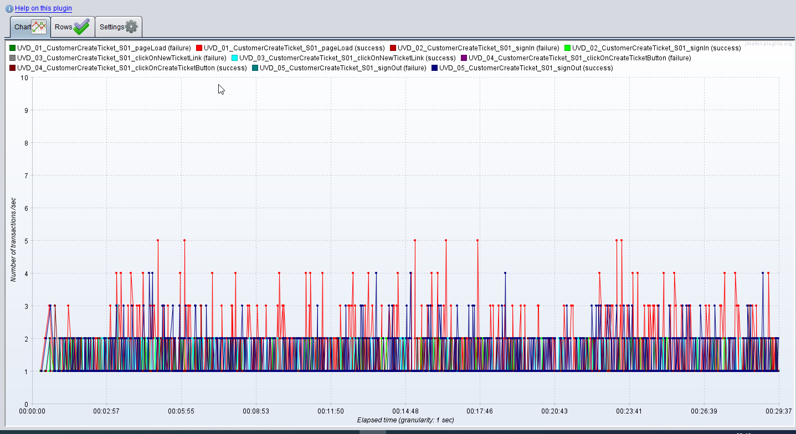
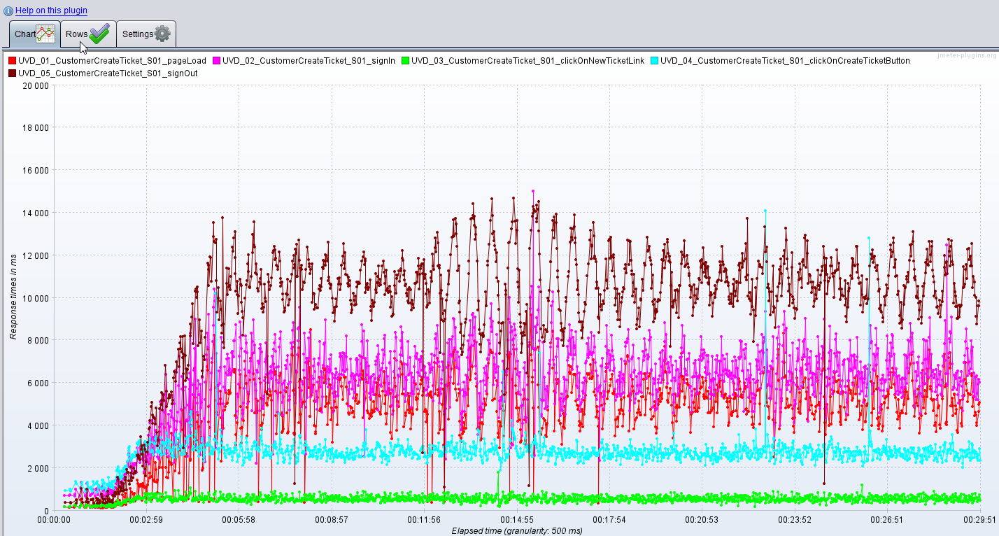
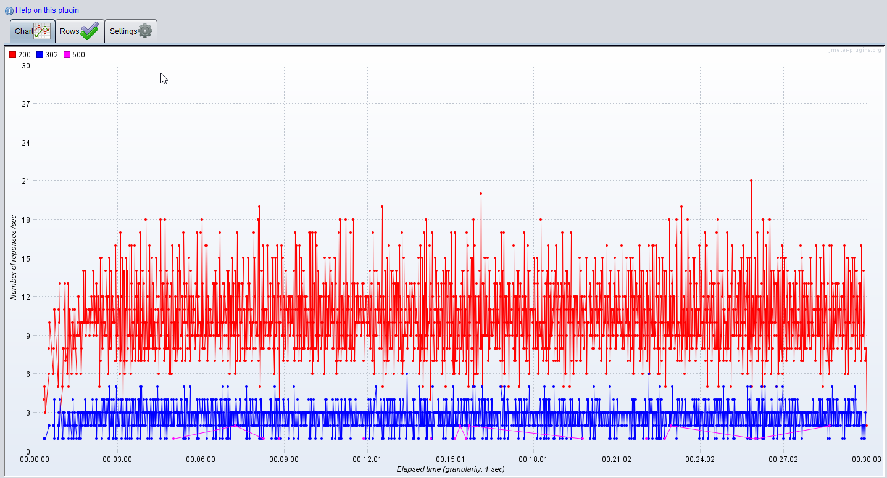
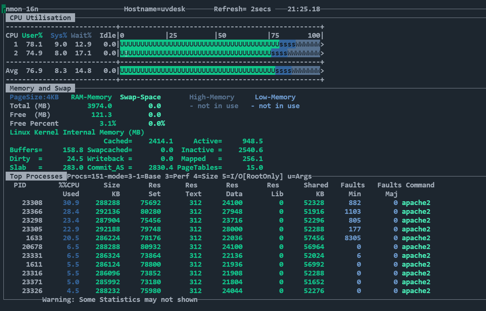
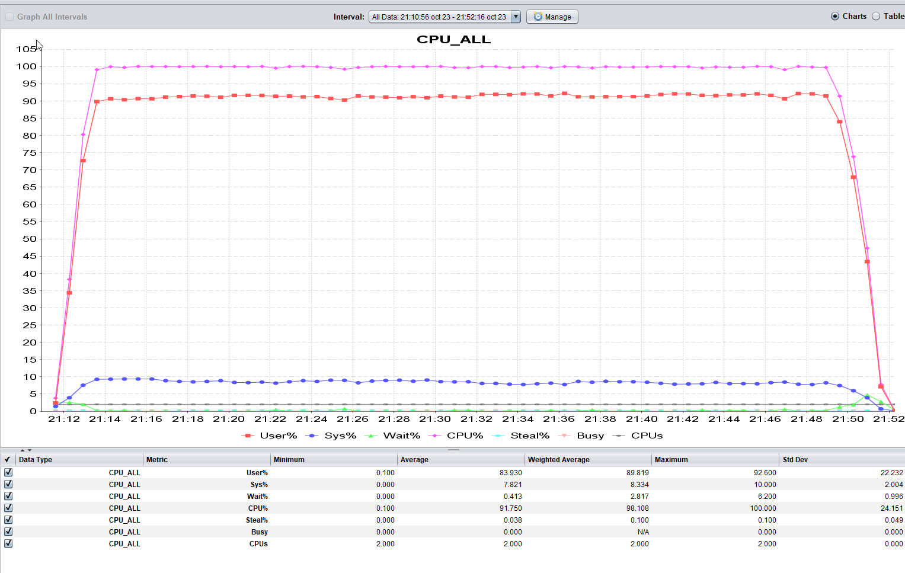

# Execution Log

- Test was configured to last 40 minutes including ramp-up and ramp-down
- When the test hit the maximum planned users it experienced some HTTP 500
- it was noticed the CPU was highly used (100% very constant)
- The memory was not affected too much on comparison the CPU
- The stats of the container showed the container was consumed basically all the CPU of the Linux server
- In steady state period it was seen the main transaction under test which was *Ticket Creation* was showing response times around 3000 ms which is above the SLO 1000ms 
- During the test the number of transactions over time was seen going between 2 and 3 TPS, it might need an adjustment if it happens the average is below the target load of 3TPS

### Active Threads Over Time

### TPS Over Time

### Response Time Over Time

### Status Codes Over Time

### CPU stats

